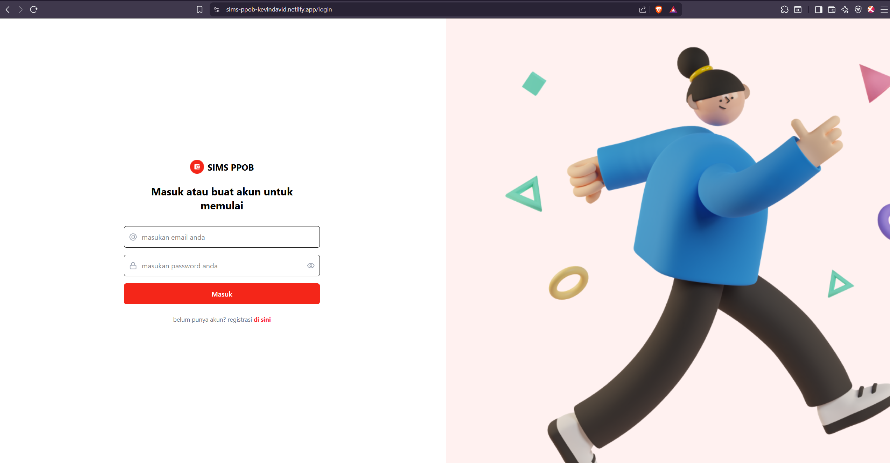
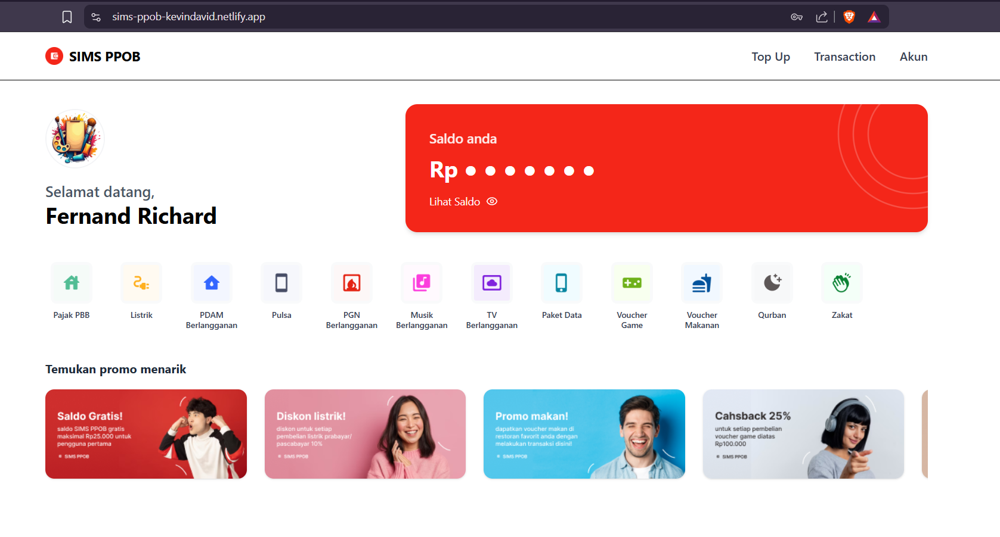
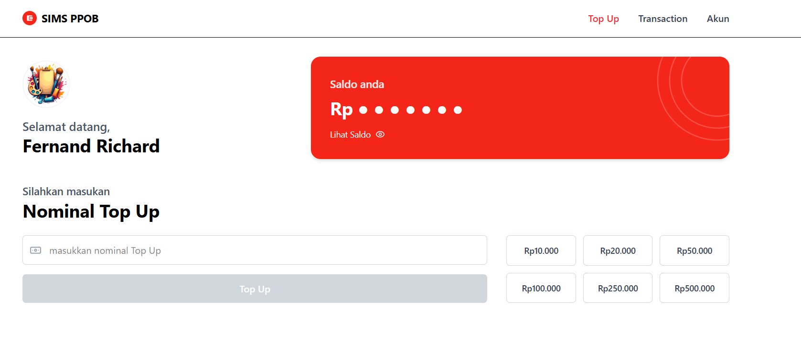
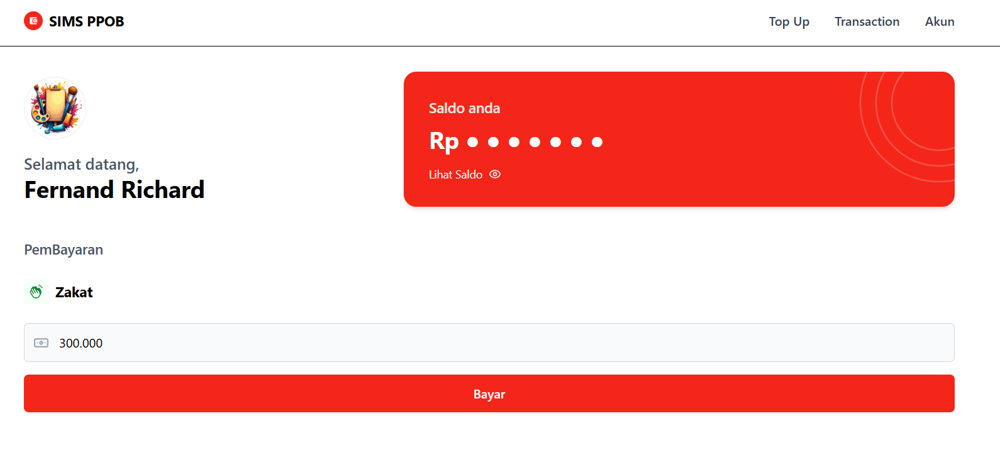
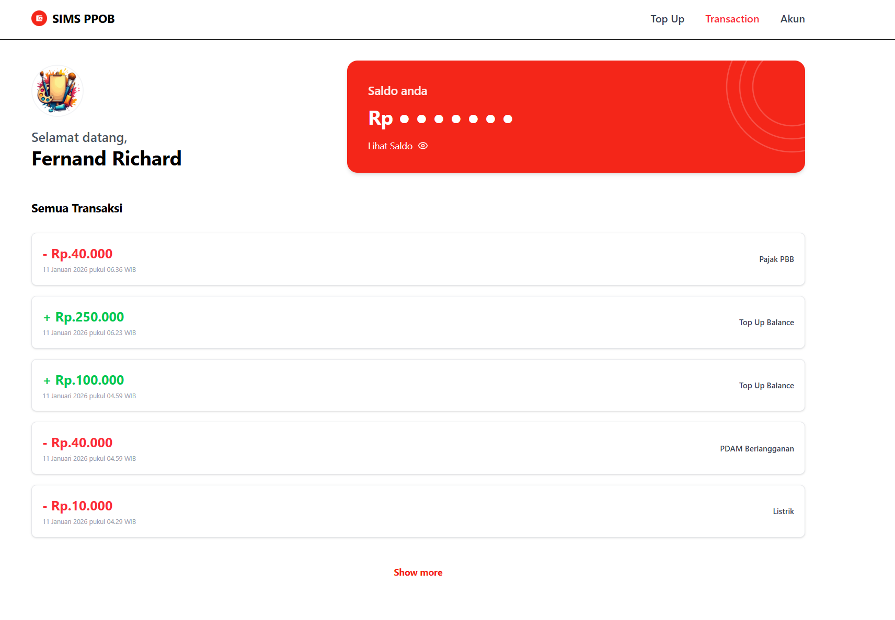
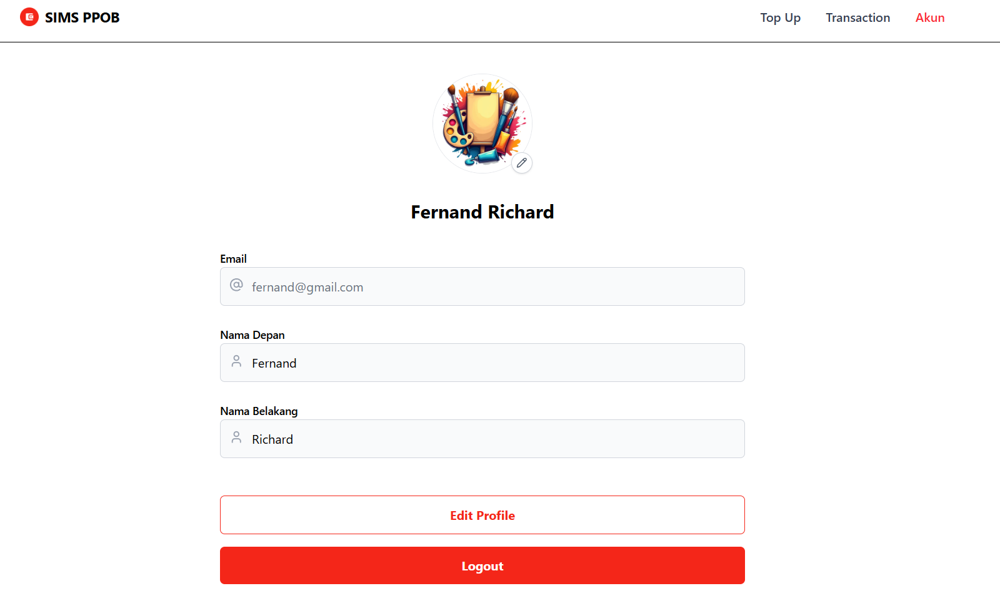

# SIMS PPOB - Kevin David Richard

Aplikasi web **SIMS PPOB** adalah project Assignment Front End Programmer untuk Departement SIMS di **PT NUTECH INTEGRASI**. Project ini mengintegrasikan aplikasi web dengan REST API untuk manajemen user, saldo, serta transaksi layanan secara real-time.

**Live Demo:** [https://sims-ppob-kevindavid.netlify.app/](https://sims-ppob-kevindavid.netlify.app/)

**Tech Stack:** React.js (Vite), Redux Toolkit, React Router v6, Tailwind CSS, Lucide React, SweetAlert2

**API Documentation**: [Nutech API Docs](https://api-doc-tht.nutech-integrasi.com/)


## Cara Menjalankan Secara Lokal


1. **Clone Repositori**:
   ```bash
   git clone https://github.com/kevindav22/sims-ppob-kevindavid.git
   cd sims-ppob-kevindavid
2. Masuk ke Folder Frontend:
   ```bash
   cd frontend
   npm install
   npm run dev
3. Build Produksi
   ```bash
   npm run build


## Screenshot Aplikasi

Login & Dashboard

 

Top Up & Transaksi

 

History & Profile

 
